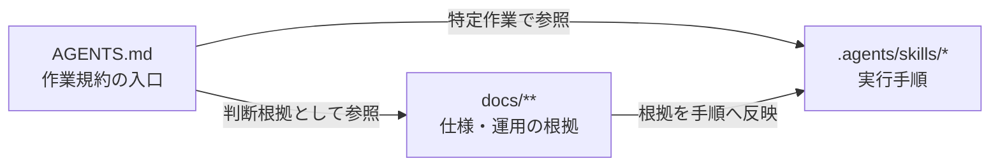

# Masahi Desu User Site エージェント規約

- リポジトリ規約の正本として `README.md` を読み、記載された開発・ビルド・成果物管理方針を守ること。
- 公開サイトのソースは `site/` 配下に置き、生成された `dist/` はコミットしないこと。

## 環境の運用方針

- リリースは、ローカルの `main` ブランチからリモートの `main` ブランチへ fast-forward で push し、GitHub Pages にデプロイする運用とすること。
- 開発は原則としてローカルの `main` ブランチで行い、リモートの `main` ブランチへの push をもってリリースを開始すること。
- 必要に応じて push 前にリモートの更新を取り込み、ローカルとリモートの `main` ブランチを同期すること。
- リリース前に `.agents/skills/release-quality-gate/SKILL.md` を読み、その手順を省略せず実行すること。
- `npm test`、PCブラウザ確認、Playwright WebKitテスト、`xcrun simctl boot` で起動したiPhone SimulatorのMobile Safari確認、本番ビルドをすべて成功させること。失敗、未実施、確認不能の項目がある場合は `main` へpushしないこと。
- 品質ゲート完了後に追跡対象ファイルを変更した場合は、全ゲートを最初から再実行すること。

## ディレクトリ責務

```text
.
├── .agents/
│   └── skills/       特定作業を再現可能に実行するための手順を管理する
├── .github/
│   └── workflows/    CI、検証、リリース、GitHub Pages へのデプロイを自動化する workflow を管理する
├── .temp/            公開・実行・継続保守に不要な一時成果物を置く。Git の追跡対象にはしない
├── dist/             Vite が生成する配信用成果物を置く。手作業で編集せず、コミットしない
├── docs/             画面仕様、設計判断、運用方針など、実装と作業手順の根拠となる文書を管理する
├── site/             公開サイトのソース、実行時アセット、配信対象ファイルを管理する
├── tests/            継続して実行する自動テストと、そのテストに必要な保守対象資源を管理する
└── tools/            開発、ビルド、検証、リリースを補助するスクリプトを管理する
```

## Agent harness での運用

Agent harness では、`AGENTS.md` を作業規約の入口、`.agents/skills/*` を特定作業の実行手順、`docs/**` を仕様と運用の根拠として扱うこと。関係は次の通り。



## 資料とリポジトリ資源の運用方針

- `AGENTS.md`、Skill、仕様、workflow、リリース手順は、実装と同じリポジトリ資源として扱うこと。必要に応じて更新し、常に最新の実装と一致させること。
- 実装だけを更新し、関係する仕様や Skill を更新しない運用は禁止する。画面仕様、リリース手順、検証方法、ディレクトリ責務が変わる場合は、関係する資料を同じ変更範囲で更新すること。
- 関係する資料、実装、テスト、Skill の更新はアトミックにコミットすること。1 つの挙動変更に必要な資源を別々のコミットへ分断しないこと。

## ローカル検証・一時成果物

- デザインQA、画面比較、スクリーンショット、ログ、トレース、レンダー出力、作業用ダウンロードなど、公開・実行・継続保守に不要な生成物は `.temp/<task-slug>/` 配下へ作成すること。
- `design-qa.md` や `design-qa-assets/` のような一時成果物をリポジトリ直下または `site/` 配下へ作成しないこと。
- 一時成果物を作成・移動・整理するときは、`.agents/skills/use-repo-temp-artifacts/SKILL.md` を先に読み、その手順を適用すること。
- `.temp/` 内のファイルはステージ・コミット・リリースしないこと。
- 一時成果物を追跡対象へ昇格するのは、ユーザーが明示した場合、または製品コード・実行時アセット・テストフィクスチャ・保守対象文書として必要な場合に限ること。昇格理由を最終報告に記載すること。
- リリース前に `git status --short` と `git check-ignore .temp/<path>` を確認し、一時成果物が追跡対象へ混入していないことを検証すること。

## 規約とSkillの同期

- `README.md` の一時成果物規約を変更した場合は、同じタスク内で `AGENTS.md` と `.agents/skills/use-repo-temp-artifacts/SKILL.md` も同期すること。
- `README.md` のリリース品質ゲートを変更した場合は、同じタスク内で `AGENTS.md`、`.agents/skills/release-quality-gate/SKILL.md`、`package.json`、GitHub Pagesを公開するすべてのworkflowを同期すること。
- 規約とSkillが矛盾する場合は `README.md` を優先し、Skill側を修正すること。
