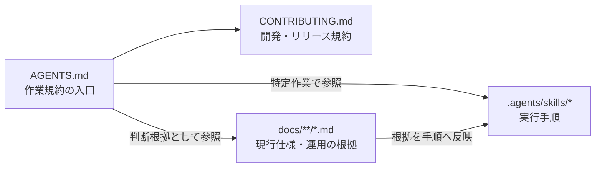

# Masahi Desu User Site エージェント規約

- プロジェクト概要と公開仕様は `README.md` を参照すること。
- 開発、ブランチ、テスト、リリース、成果物管理の正本は `CONTRIBUTING.md` とし、記載された規約を守ること。
- 公開サイトのソースは `site/` 配下に置き、生成された `dist/` はコミットしないこと。

## Agent harness での運用

Agent harness では、`AGENTS.md` を作業規約の入口、`CONTRIBUTING.md` を共通の開発・リリース規約、`.agents/skills/*` を特定作業の実行手順、現行状態と明示された `docs/**/*.md` を仕様と運用の根拠として扱うこと。歴史資料は、最寄りの `README.md` で現行仕様と明示されていない限り実装根拠にしないこと。

```mermaid
flowchart LR
    A["AGENTS.md<br/>作業規約の入口"] --> C["CONTRIBUTING.md<br/>開発・リリース規約"]
    A -->|"特定作業で参照"| S[".agents/skills/*<br/>実行手順"]
    A -->|"判断根拠として参照"| D["docs/**/*.md<br/>現行仕様・運用の根拠"]
    D -->|"根拠を手順へ反映"| S
```

## Skill の適用

- `main` へのpush前に `.agents/skills/release-quality-gate/SKILL.md` を読み、完全な差分から変更区分を判定し、その区分に必要な手順を省略せず実行すること。文書・規約だけの変更に公開物向けのブラウザ検証を適用しないこと。
- 一時成果物を作成、移動、整理するときは、先に `.agents/skills/use-repo-temp-artifacts/SKILL.md` を読み、その手順を適用すること。
- ブラウザ操作、画面検証、スクリーンショット、UI flow check、localhost の実ブラウザ確認を行う前に、グローバルの `browser-noninvasive-verification` Skill を選定ゲートとして適用すること。

## 資料とリポジトリ資源の運用方針

- `AGENTS.md`、`CONTRIBUTING.md`、Skill、仕様、workflow、リリース手順は、実装と同じリポジトリ資源として扱うこと。
- 実装だけを更新し、関係する仕様や Skill を更新しない運用は禁止する。画面仕様、リリース手順、検証方法、ディレクトリ責務が変わる場合は、関係する資料を同じ変更範囲で更新すること。
- 関係する資料、実装、テスト、Skill の更新はアトミックにコミットすること。1 つの挙動変更に必要な資源を別々のコミットへ分断しないこと。

## 規約と Skill の同期

- `CONTRIBUTING.md` の一時成果物規約を変更した場合は、同じタスク内で `AGENTS.md` と `.agents/skills/use-repo-temp-artifacts/SKILL.md` も同期すること。
- `CONTRIBUTING.md` のリリース品質ゲートを変更した場合は、同じタスク内で `AGENTS.md`、`.agents/skills/release-quality-gate/SKILL.md`、`package.json`、GitHub Pages を公開するすべての workflow を同期すること。
- 開発・リリース規約と Skill が矛盾する場合は `CONTRIBUTING.md` を優先し、Skill 側を修正すること。
