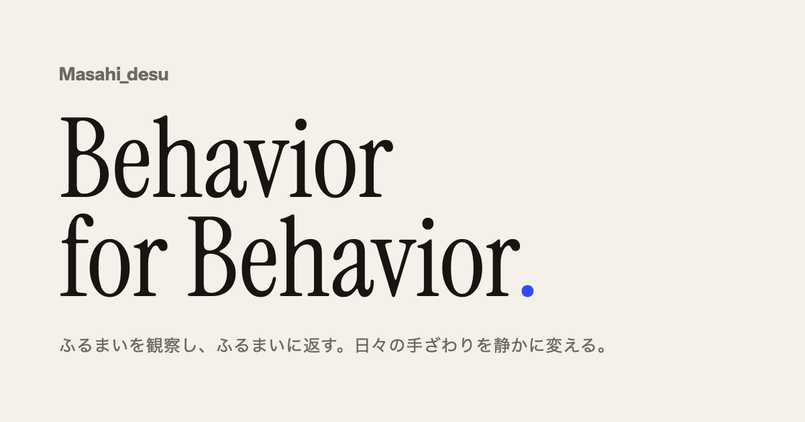

# Masahi Desu User Site

Masahi Desu の製品情報を公開する GitHub Pages ユーザーサイトです。

- 公開サイト: https://masashi-desu.github.io/
- 公開ソース: `site/`
- ビルドツール: Vite
- 配信先: GitHub Pages

Vite は `site/` 内の HTML を入力として `dist/` を生成し、GitHub Actions は生成された `dist/` を Pages artifact としてアップロードします。ユーザーサイトのルート配下に公開するため、本番ビルドの `base` は `/` です。

## 開発ドキュメント

開発環境、ブランチ運用、テスト、リリース、一時成果物、実装上の規約は [CONTRIBUTING.md](./CONTRIBUTING.md) を参照してください。

- `CONTRIBUTING.md`: 人とエージェントに共通する開発・リリース規約
- `AGENTS.md`: Agent harness で作業するときの入口と Skill の適用規則
- `THIRD_PARTY_LICENSES.md`: 利用する第三者ソフトウェアとWebフォントの一覧
- `.agents/skills/`: 特定作業の再現可能な実行手順
- `docs/**/*.md`: 現行の画面仕様、設計判断、運用方針の根拠
- `docs/design/works.pen`: 旧画面の比較用に保存している歴史資料。位置づけは `docs/design/README.md` を参照

## TypeFetch Sparkle appcast

TypeFetch の更新情報は `site/products/TypeFetch/appcast.xml` を正本として、GitHub Pages の次の 2 URL に配信します。

- 正式 URL: `https://masashi-desu.github.io/products/TypeFetch/appcast.xml`
- 旧バージョン互換 URL: `https://masashi-desu.github.io/works/products/TypeFetch/appcast.xml`

旧 URL は TypeFetch 1.1.0 との互換性を維持するためのもので、Vite build が正式 appcast と同じ内容を生成します。appcast の更新・検証・公開手順は [CONTRIBUTING.md の「TypeFetch Sparkle appcast」](./CONTRIBUTING.md#typefetch-sparkle-appcast) を参照してください。
